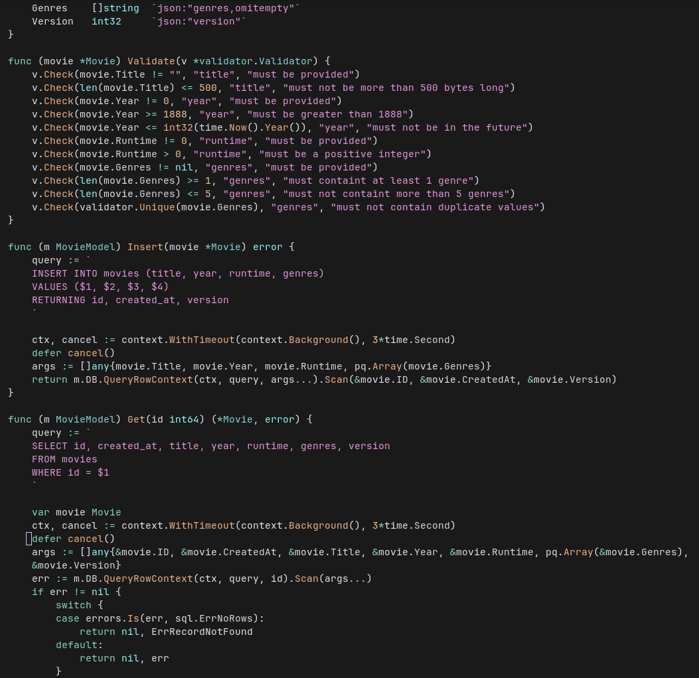

# cursordark.nvim

Neovim version of [Cursor Dark Theme for vscode](https://marketplace.visualstudio.com/items?itemName=imzivko.cursor-dark-core) generated with [Djanho](https://github.com/viniciusmuller/djanho)



## Installation (Lazy.nvim)

```lua
{
  "pedrodrago/cursordark.nvim",
  lazy = false,
  priority = 1000,
  config = function()
    vim.cmd("colorscheme cursordark")
  end,
}
``` 

**OBS**: The result is not identical to cursor/vscode themes. [cursordark.json](./cursordark.json) is the original json from [Cursor Dark Theme for vscode extension](https://marketplace.visualstudio.com/items?itemName=imzivko.cursor-dark-core). 
